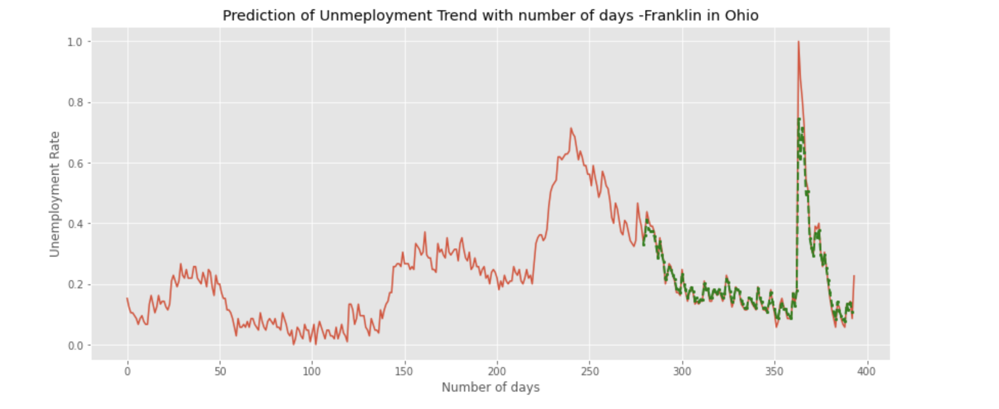

# Human Centered Data Science - Final Project

## About the Project
The repository contains the code and the data to reproduce the results for the analysis of the COVID-19 cases at Frankilin in
Ohio in the United States of America. As the part of this project I wanted to understand and answer the below mentioned research questions:

1. Does mask mandate help in the reduction of the rate of spread of covid-19 infections?
2. Is COVID-19 spread of infections causation for unemployment rate in Franklin?
3. How can LSTMs be used to predict the unemployment rate using the past time series data.
the effect of mask mandate that was 

The data analysis for this project includes data acquisition, data processing, statistical testing and predictive modeling. This project was the part of Human Centered Data Science at the University of Washington - Seattle for Autumn 2022. The project contains all the details to reproduce this analysis independently on any machine without the use of any specific software package.

## API Documentation For Data Download
The data acquisition was done acquired from the three different data sources. The details for the data source is present below:

1. [John Hopkins University COVID-19 data](https://www.kaggle.com/datasets/antgoldbloom/covid19-data-from-john-hopkins-university)
2. [masking mandates by county](https://data.cdc.gov/Policy-Surveillance/U-S-State-and-Territorial-Public-Mask-Mandates-Fro/62d6-pm5i)
3. [mask compliance survey](https://github.com/nytimes/covid-19-data/tree/master/mask-use)
4. [Franklin Unemployment](https://fred.stlouisfed.org/series/OHFRAN0URN)


## Directory Structure
The directory structure for the repository has been shown below in the form of a tree.

```

.
├── raw_data
│   ├── mask_use_by_county.csv
│   ├── RAW_us_confirmed_cases.csv
│   ├── Frankiln_Unemployment_Data.csv
│   ├── US_State_and_Territorial_Public_Mask_Mandates_From_April_10__2020_through_August_15__2021_by_County_by_Day.csv
│ 
├── plots
│   ├── autocorrelation.png
│   ├── OLS_counterfactual.png
│   └── partial_autocorrelation.png
│   └── qqplot_ols_and_ARIMA.png
│   └── ARIMA.png
│   └── LSTM_output.png
│ 
├── src
│   └── Common_Analysis.ipynb
│   └── Part_2_Extended_Analysis.ipynb
│ 
├── project_report
│   └── Final_Project_doc.pd
│ 
├── README.md
└── LICENSE


```

## Data Description
The data description for the csv files is shown below:
1. #### John Hopkins University COVID-19 data - RAW_us_confirmed_cases.csv

| Column                    | Description                                                                        |
| ------------------------- | -----------------------------------------------------------------------------------|
| `Province_State`           | Name of the Province state                                                        |
| `Admin_2`                  | Name of the country                                                       |
| `UID`                      | UID for country                                                |
| `iso2`                     | ISO 3166-1 alpha-2 codes are two-letter country codes  |
| `iso3`                     | ISO 3166-1 alpha-3 codes are two-letter country codes             |
| `Country_Region`           | Name of the country                      |
| `lat`                      | Ilatitude of the country in state |
| `long`                     | longitude of the country  in state          |
| `date`                     | Dates in dd-mm--yy format                     |

2. #### masking mandates by county - mask_use_by_county.csv

| Column                    | Description                                                                        |
| ------------------------- | -----------------------------------------------------------------------------------|
| `State_Tribe_Territory`   | Name of the Province state                                                        |
| `County_Name`             | Name of the country                                                       |
| `FIPS_State`              | UID for country                                                |
| `FIPS_County`             | ISO 3166-1 alpha-2 codes are two-letter country codes  |
| `date`                       | Name of the Province state                                                |
| `order code`                  | Name of the country                                                       |
| `Face_Masks_Required_in_Public`| UID for country                                                |
| `Source_of_Action`              | ISO 3166-1 alpha-2 codes are two-letter country codes  |
| `URL`                           | UID for country                                                |
| `Citation`                     | ISO 3166-1 alpha-2 codes are two-letter country codes  |

3. #### mask compliance survey - US_State_and_Territorial_Public_Mask_Mandates_by_County_by_Day

| Column                    | Description                                                                        |
| ------------------------- | -----------------------------------------------------------------------------------|
| `COUNTYFP`                | FYP code of the country                                                 |
| `NEVER`                  | Percentage of population in territory who NEVER wear the mask                                 |
| `RARELY`                 | Percentage of population in territory who RARELY wear the mask                       |
| `SOMETIMES`               | Percentage of population in territory who SOMETIMES wear the mask  |
| `FREQUENTLY`              | Percentage of population in territory who FREQUENTLY wear the mask  |
| `ALWAYS`                  | Percentage of population in territory who ALWAYS wear the mask  |

4. #### Franklin Unmeployment Data - Frankiln_Unemployment_Data.csv

| Column                    | Description                                                                        |
| ------------------------- | -----------------------------------------------------------------------------------|
| `Date`                | Date of the month in YYYY-MM-DD format                                               |
| `Unemployment_Rate`                  | Percentage of unemployment in Franklin in Ohio           


#### Note: 
I have ignored the file csv US_State_and_Territorial_Public_Mask_Mandates_by_County_by_Day in my repository because of size issues. The same could be downloaded for reproducibilty for this assignment from [masking mandates by county](https://data.cdc.gov/Policy-Surveillance/U-S-State-and-Territorial-Public-Mask-Mandates-Fro/62d6-pm5i)

## Visualization

### Before_and_after_intervention_and_how_it_project_a_counterfactual for Franklin in Ohio


### Autocorrelation


### Partial Autocorrelation


### ARIMA - Before_and_after_intervention_and_how_it_project_a _counterfactual for Franklin in Ohio


### LSTM - Prediction of Unemployment Rate with number of days -Franklin in Ohio in United States of America


## License

This code is available under the [MIT License](LICENSE)

Wikimedia [Terms of Use](https://foundation.wikimedia.org/wiki/Terms_of_Use/en)
